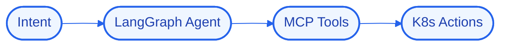

# HelixControl
### Agentic infrastructure orchestrator and MCP runtime for autonomous DevOps.


## 📖 Overview
HelixControl turns operator intent into safe infrastructure actions: a LangGraph agent plans, MCP tools execute against Kubernetes, and guardrails keep autonomous operations within bounds.

> Part of my Senior Hybrid Engineer 2026 portfolio (`AX-04`). Built on the "Antigravity" model — logic, state, and UI run locally in Docker while heavy reasoning is offloaded to cloud APIs, so the whole system runs on modest hardware.

## 🚀 Quick Start
```bash
# 1. Clone
git clone https://github.com/Kimosabey/helix-control.git
cd helix-control

# 2. Install
# (see docs/GETTING_STARTED.md for the full setup)

# 3. Run
docker compose up
```

## ✨ Key Features
- Intent → plan → action agent loop
- MCP tools for real infra operations
- Kubernetes-native actions
- Guardrails and approval gates

## 🏗️ Architecture


Letting an agent act on infrastructure while keeping it provably safe with guardrails and approvals.

See [docs/ARCHITECTURE.md](./docs/ARCHITECTURE.md) for the full HLD/LLD and design decisions.

## 🧰 Tech Stack
| Layer | Technology | Role |
| :--- | :--- | :--- |
| LangGraph | `LangGraph` | Stateful multi-agent orchestration |
| MCP | `MCP` | Model Context Protocol tooling |
| Kubernetes | `Kubernetes` | Container orchestration |

## 📚 Documentation
- [Architecture](./docs/ARCHITECTURE.md) — high- and low-level design, decision log
- [Getting Started](./docs/GETTING_STARTED.md) — prerequisites, setup, environment
- [Failure Scenarios](./docs/FAILURE_SCENARIOS.md) — fault analysis and recovery
- [Interview Q&A](./docs/INTERVIEW_QA.md) — deep-dive walkthrough

## 🔭 Future Enhancements
- Dry-run planning
- Policy-as-code guardrails
- Audit trail of agent actions

## 📄 License
Released under the MIT License.

## 👤 Author

**Harshan Aiyappa**
Senior Full-Stack Hybrid AI Engineer
Voice AI • Distributed Systems • Infrastructure

[](https://kimo-nexus.vercel.app/)
[](https://github.com/Kimosabey)
[](https://linkedin.com/in/harshan-aiyappa)
[](https://x.com/HarshanAiyappa)
