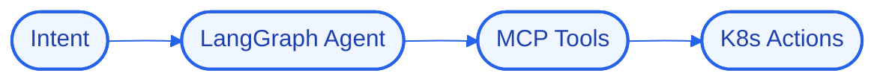

# Architecture — HelixControl

## High-Level Design (HLD)
HelixControl turns operator intent into safe infrastructure actions: a LangGraph agent plans, MCP tools execute against Kubernetes, and guardrails keep autonomous operations within bounds.

**Flow:** Intent → LangGraph Agent → MCP Tools → K8s Actions

## Low-Level Design (LLD)
- **Components:** `LangGraph`, `MCP`, `Kubernetes`
- **Interfaces / contracts:** to be finalized during implementation.
- **Data model:** to be defined per component.

## Decision Log
- **Why this stack:** **LangGraph** — stateful multi-agent orchestration; **MCP** — model context protocol tooling; **Kubernetes** — container orchestration.
- **Antigravity constraint:** run logic/state/UI locally; offload heavy reasoning to cloud APIs; target modest hardware.

## Concept Deep Dive
Letting an agent act on infrastructure while keeping it provably safe with guardrails and approvals.
